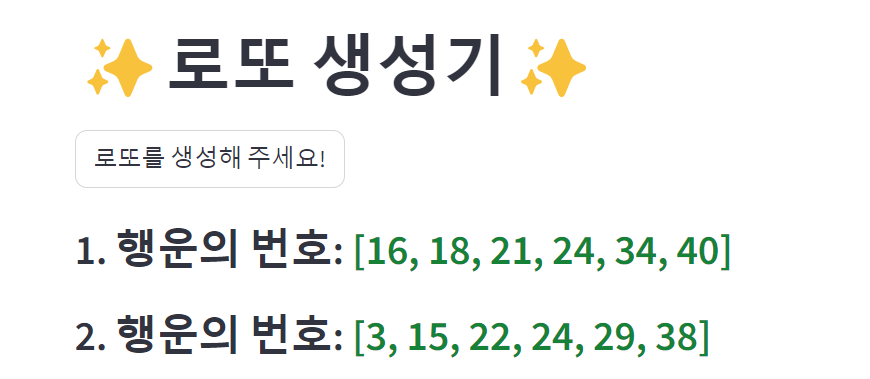
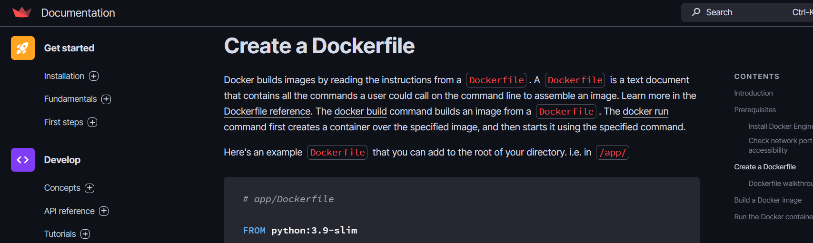
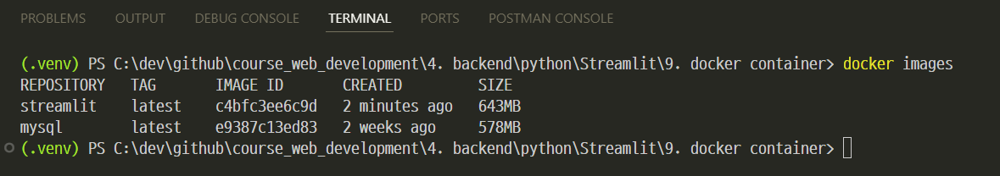
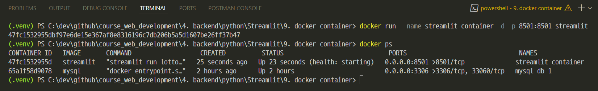
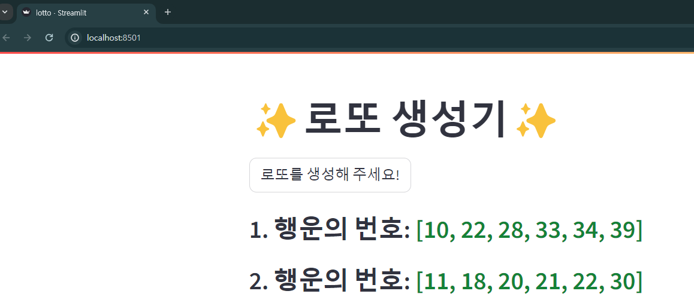

### 단계1: lotto.py 확인 
```shell
streamlit run lotto.py
```


---
### 단계2: [도커파일 생성](https://docs.streamlit.io/deploy/tutorials/docker)
- 참고문서: `Dockerfile`



---
### 단계3: [Build a Docker image](https://docs.streamlit.io/deploy/tutorials/docker#build-a-docker-image) 
```shell
docker build -t streamlit .
docker images
```


---
### 단계4: [Run the Docker container](https://docs.streamlit.io/deploy/tutorials/docker#run-the-docker-container) 
```shell
docker run --name streamlit-container -d -p 8501:8501 streamlit
docker ps
```


---
### 단계5: 접속 > http://localhost:8501

