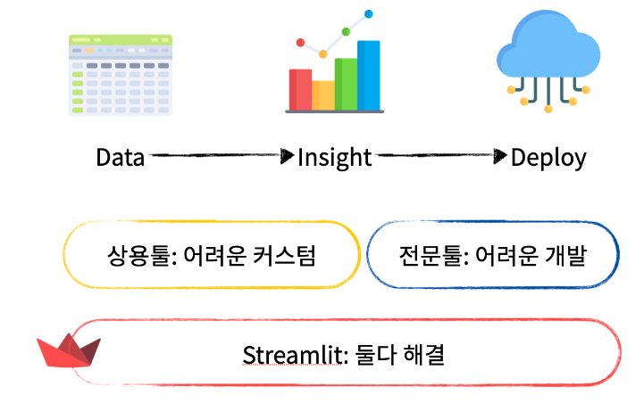
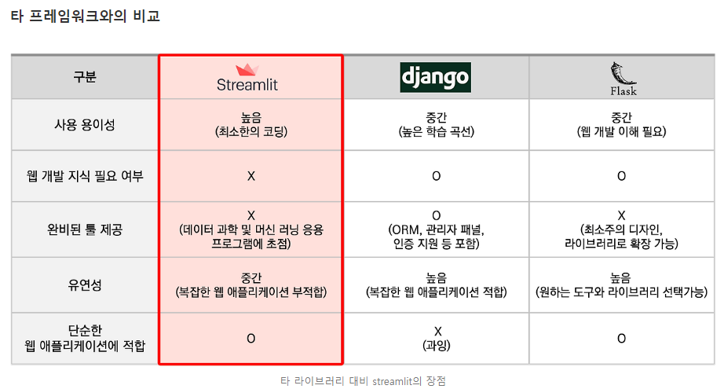

# [Streamlit이란?](https://yozm.wishket.com/magazine/detail/1827/)
- Streamlit은 데이터 사이언티스트, 엔지니어, 그리고 분석가들이 Python으로 데이터 앱을 빠르고 쉽게 만들 수 있도록 돕는 오픈 소스 앱 프레임워크이다.

---
### [Streamlit 장점](https://wscode.tistory.com/126)
- `간편성`: 복잡한 프론트엔드 지식이 없어도 웹 앱을 만들 수 있습니다.
- `반응형`: 자동으로 업데이트되는 위젯을 제공하여 데이터와 시각화의 상호작용을 쉽게 구현할 수 있습니다.
- `데이터 통합`: 주요 데이터 분석 및 시각화 라이브러리 (예: Pandas, Matplotlib, Plotly)와의 통합이 용이합니다.

### Streamlit 단점
- 사용용도에 따라서 단순한 웹 애플리케이션을 생성하는 경우 streamlit이 합리적이며, 대규모 배포의 경우에는 다른 프레임워크가 적합할 수 있으므로 용도에 따라서 선택하여 활용이 필요합니다.
---

---
# 참고문서들
- https://docs.streamlit.io/develop/tutorials
- https://github.com/teddylee777/streamlit-tutorial
- https://www.datacamp.com/tutorial/streamlit
- https://www.machinelearningnuggets.com/streamlit-tutorial/#streamlit-configurations

