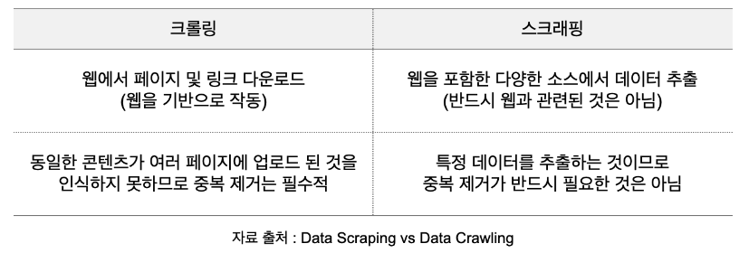
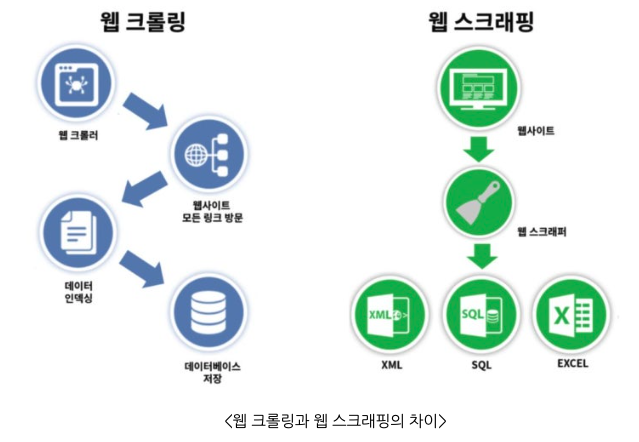
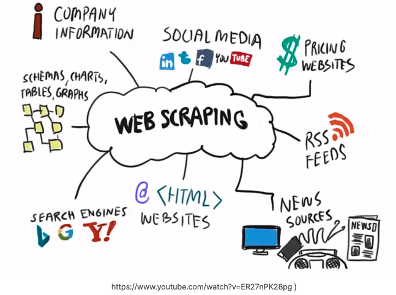
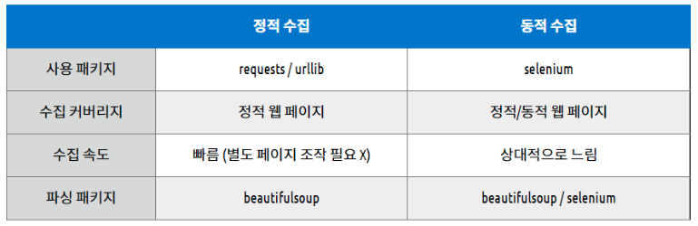
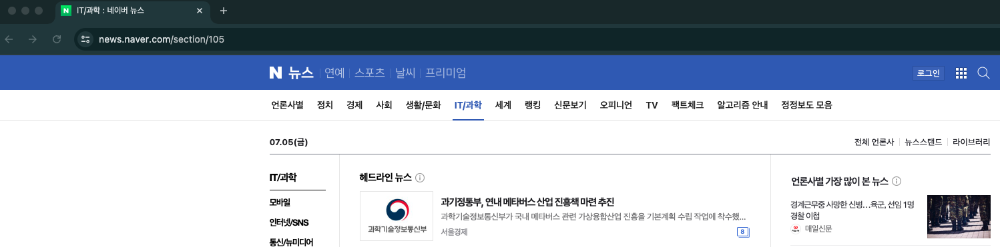
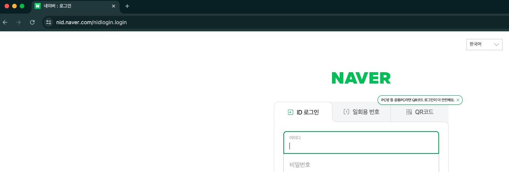
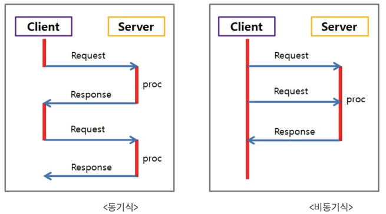

# [Web Crawling vs Web Scraping](https://m.blog.naver.com/hyemin8670/222207166851)
- `웹 스크래핑(Web Scraping)`이란 웹 사이트 상에서 원하는 정보를 추출하는 방법을 의미합니다.
- `웹 크롤링(Web Crawling)`이란 웹 크롤러(web crawler)가 정해진 규칙에 따라 복수 개의 웹페이지를 탐색하는 행위라고 하며, 웹 스파이더링이라고도 합니다.

---
- 하지만 요즘은 `웹 크롤링`의 뜻이 확대되어 웹페이지 탐색 후 원하는 정보 추출(Web scraping)하여 저장하는 것을 의미하는 경우가 더 많다. 

---
# 웹 크롤링 주요 용도
- 웹 크롤링은 다양한 분야에서 활용되고 있다. 
- 시장 연구, 경쟁사 분석, SNS 트랜드 파악 등 다양한 분야에서 크롤링을 황용해 데이터를 수집하고 분석하여 의사결정에 활용하고 있습니다.

---
### 활용사례 1) E-commerce 사이트에서의 가격 정보 수집
- 온라인 쇼핑몰에서는 상품의 가격 정보를 주기적으로 업데이트한다. 
- 크롤링을 통해 이러한 가격 변동을 실시간으로 파악하고, 경쟁사의 가격 전략을 분석하는데 활용될 수 있다. 
- 이는 마케팅 전략 수립에 있어 중요한 역할을 한다.

### 활용사례 2) 소셜 미디어 데이터 분석을 위한 크롤링
- 소셜 미디어는 현재의 트렌드와 사회의 의견을 반영하는 중요한 공간이다. 
- 특정 주제나 키워드에 대한 사람들의 반응을 파악하기 위해 크롤링을 통한 데이터 수집이 이루어진다. 
- 이렇게 수집된 데이터는 다양한 분석 방법을 통해 유용한 인사이트를 제공한다.

---
# [웹 크롤링은 합법인가?](https://jinooh.tistory.com/3)

---
## 문제가 되는 크롤링
- 수집한 데이터의 상업적 이용
- 크롤링 과정에서 해당 서버의 문제 야기
- 수집한 데이터가 사용자의 민감한 정보인지
- 사이트의 이용방침, 의사(robots.txt, 이용목적)을 위반하지 않는지
  - 대부분의 웹사이트는 `robots.txt`라는 파일을 통해 크롤러의 접근을 제어한다. 

---
## 대표적인 국내 사례
### 잡코리아 - 사람인
- 원고 - 잡코리아 / 피고 -사람인
- (주)사람인의 웹사이트에 잡코리아의 채용 정보를 크롤링하여 기재한 사건
- 피고는 원고에 2억5천여만원 지급

### 야놀자 - 여기어때(진행중)
- 원고 - 야놀자 / 피고 -여기어때
- 야놀자의 제휴 숙박업소, 목록, 주소, 정보, 가격 정보 등을 API를 통해 크롤링하여 여기어때 서비스에 무단으로 복제한 사건

---
# [웹 크롤링 종류](https://velog.io/@dorong_park/%EC%9B%B9-%ED%81%AC%EB%A1%A4%EB%A7%81-%EA%B8%B0%EC%B4%88-1.-%EB%8F%99%EC%A0%81%EC%A0%95%EC%A0%81-%EC%9B%B9%ED%8E%98%EC%9D%B4%EC%A7%80-%EA%B5%AC%EB%B3%84)
- 웹 크롤링을 하면서 우리들이 만나는 페이지는 총 2가지가 있다. 
- 하나는 정지해있는 의미의 `정적(static)`과 다른 한가지는 움직인다는 의미의 `동적(dynamic)`이다.

---
## 정적 웹 페이지 크롤링
- 정적 웹 페이지란 서버(Web Server)에 미리 저장된 파일이 그대로 전달되는 웹 페이지를 말합니다.
- 즉, 특정 웹페이지의 url 주소만 주소창에 입력하면 웹 브라우저로 HTML 정보를 마음대로 가져올 수 있습니다.

---
### 장점
- 요청에 대한 파일만 전송하면 되기 때문에 서버간 통신이 거의 없고 속도가 빠름
- 단순한 문서들로만 이루어져 있어서 어떤 호스팅서버에서도 동작 가능하므로 구축하는데 드는 비용이 적음

### 단점
- 저장된 정보만 보여주기 때문에 서비스가 한정적
- 추가, 수정, 삭제 등의 작업을 서버에서 직접 다운받아 편집 후 업로드로 수정해줘야 하기 때문에 관리가 어려움

---
## 동적 웹 페이지 크롤링
- 동적 웹 페이지란 입력, 클릭, 로그인 등 여러 이유로 `동기/비동기 통신` 형태로 서버(Was Server)와 데이터를 주고 받아 동적으로 제공하는 웹 페이지를 말합니다.

---
### 장점
- 다양한 정보를 조합하여 웹 페이지를 제공하기 때문에 서비스가 다양함
- 추가, 수정, 삭제 등의 작업이 가능하기 때문에 관리가 편함

### 단점
- 웹 페이지를 보여주기 위해서 여러번의 비동기 통신을 처리하기 때문에 상대적으로 속도가 느림

---
### [동기와 비동기 통신 방식 차이](https://sjparkk-dev1og.tistory.com/27)
- 동기식은 요청 후 응답을 받아야지만 다음 동작이 이뤄지고 비동기식에서는 요청을 보낸 후 응답과는 상관없이 동작하는 방식이다.

---
# 주요 크롤링 모듈(라이브러리)
### [requests](https://www.daleseo.com/python-requests/)
- 파이썬 HTTP 통신에 사용되는 모듈
- 설치방법: pip install requests

### [beautifulsoup](https://wikidocs.net/85739)
- HTML, XML, JSON 등 파일의 구문을 분석하는 모듈
- 설치방법: pip install beautifulsoup4

### [selenium](https://gorokke.tistory.com/8)
- 웹 브라우저를 이용하는 자동화 프로그램입니다.
- 설치방법: pip install selenium

