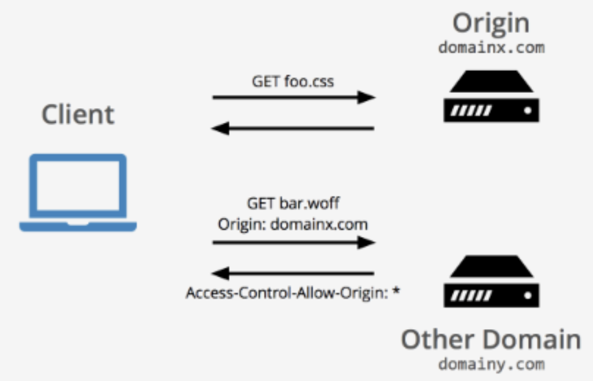
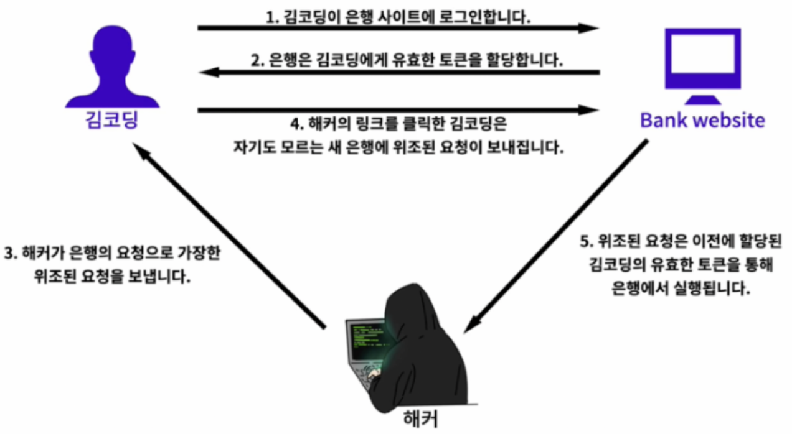
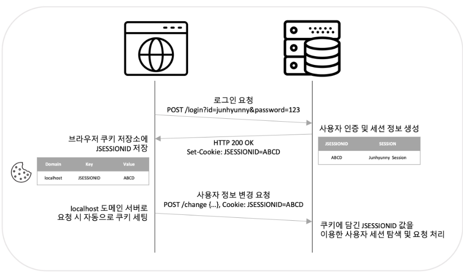
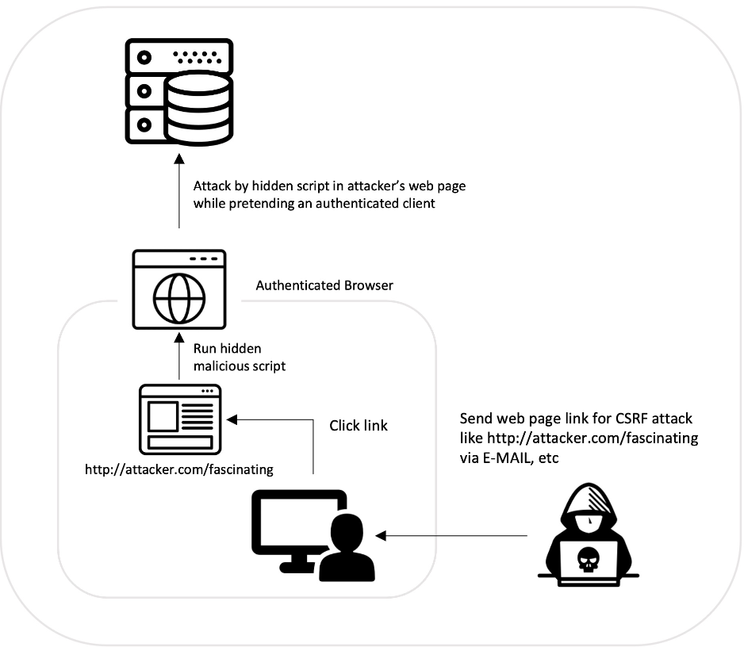
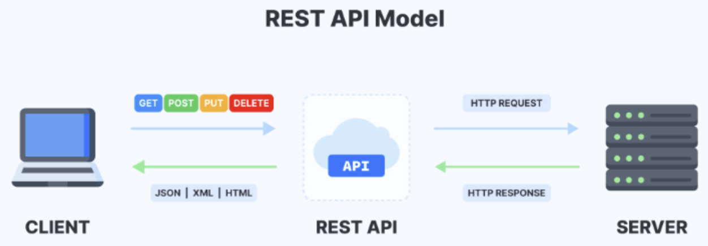
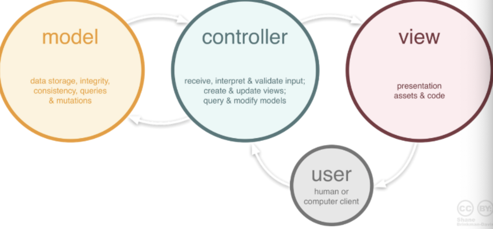

# [Web Overview](./Web%20Overview.md)
- 웹표준(Web Standards)
- 크로스 브라우징(Cross-Browsing)
- 웹접근성(Web Accessibility)
- 검색 엔진 최적화(Search Engine Optimize)
- HTTP / HTTPS 프로토콜

---
# [로그인](./login.md)
- Authentication(인증)
- Authorization(인가)

---
# [CORS란?](https://velog.io/@gwanuuoo/CORS%EB%9E%80-%EB%AC%B4%EC%97%87%EC%9D%B8%EA%B0%80)
교차 출처 리소스 공유(Cross-Origin Resource Sharing, CORS)는 브라우저가 추가 HTTP 헤더를 사용하여, 한 출처에서 실행 중인 웹 애플리케이션이 다른 출처의 선택한 자원에 접근할 수 있는 권한을 부여하도록 브라우저에 알려주는 체제 - MDN

---
- Why CORS?
아래와 같이 해커로 부터 보호하기 위해서 만들어진 규칙이다.

---
# [CSRF(Cross-Site Request Forgery)](https://junhyunny.github.io/information/security/spring-boot/spring-security/cross-site-reqeust-forgery/)
- CSRF(Cross-Site Request Forgery) - 사이트 간 요청 위조
- 사용자가 자신의 의지와는 무관하게 공격자가 의도한 행위(수정, 삭제, 등록 등)를 특정 웹사이트에 요청하게 하는 공격을 말한다.

---
### Cookie and Session
우선 쿠키와 세션에 대한 간단한 이해가 필요합니다. 사용자가 특정 서버에 로그인하면 일반적으로 다음과 같은 작업들이 수행됩니다.

1. 서버는 로그인 시 인증된 사용자의 정보를 세션(session)에 저장하고, 이를 찾을 수 있는 sessionID을 만듭니다.
2. 서버는 저장된 세션 정보를 클라이언트(브라우저)가 사용할 수 있도록 sessionID를 Set-Cookie 헤더에 담아서 전달합니다.
3. 클라이언트(브라우저)는 전달된 sessionID를 쿠키에 저장합니다.
4. 클라이언트(브라우저)는 해당 도메인을 가진 서버로 요청 시 쿠키에 저장된 sessionID를 자동으로 전달합니다.
5. 서버는 쿠키에 담긴 sessionID를 통해 인증된 사용자인지 여부를 확인합니다.
---

---
### CSRF 전제 조건과 공격 과정
CSRF 공격을 위한 조건과 과정에 대해 알아보겠습니다. CSRF 공격을 시도하기 위해선 아래와 같은 몇 가지 조건이 필요합니다.
- 사용자가 보안이 취약한 서버로부터 이미 인증을 받은 상태여야 합니다.
- 쿠키 기반으로 서버 세션 정보를 획득할 수 있어야 합니다.
- 공격자는 서버를 공격하기 위한 요청 방법에 대해 미리 파악하고 있어야 합니다. 예상치 못한 파라미터가 있으면 불가능합니다.

위와 같은 조건이 만족되면 다음과 같은 과정을 통해 CSRF 공격이 수행됩니다.

1. 사용자는 보안이 취약한 서버에 로그인합니다.
2. 로그인 이후 서버에 저장된 세션 정보를 사용할 수 있는 sessionID가 사용자 브라우저 쿠키에 저장됩니다.

---
3. 공격자는 서버에 인증된 브라우저의 사용자가 악성 스크립트 페이지를 누르도록 유도합니다.
  - 해당 악성 스크립트가 담긴 페이지를 클릭하도록 유도하는 방법은 다양한 것 같으나 몇 가지 유형을 정리하자면 다음과 같습니다.
  - 게시판에 악성 스크립트를 게시글로 작성하여 관리자 혹은 다른 사용자들이 게시글을 클릭하도록 유도합니다.
  - 메일 등으로 악성 스크립트를 직접 전달하거나, 악성 스크립트가 적힌 페이지 링크를 전달합니다.
4. 사용자가 악성 스크립트가 작성된 페이지 접근시 쿠키에 저장된 sessionID는 브라우저에 의해 자동적으로 함께 서버로 요청됩니다.
5. 서버는 쿠키에 담긴 sessionID를 통해 해당 요청이 인증된 사용자로부터 온 것으로 판단하고 처리합니다.

---

---
### CSRF 방어 방법
- Referrer 검증
서버에서 사용자의 요청에 Referrer 정보를 확인하는 방법이 있습니다. 요청 헤더(request header) 정보에서 Referrer 정보를 확인할 수 있습니다. 보통이라면 호스트(host)와 Referrer 값이 일치하므로 둘을 비교합니다. CSRF 공격의 대부분 Referrer 값에 대한 검증만으로 방어가 가능하다고 합니다.

---
- CSRF 토큰 검증
임의의 CSRF 토큰을 만들어 세션에 저장합니다. 요청하는 페이지에 hidden 타입 input 태그를 이용해 토큰 값을 함께 전달합니다. 이후 서버에서 세션에 저장된 CSRF 토큰 값과 요청 파라미터에 담긴 토큰 값을 비교합니다.
- Double Submit Cookie 검증
브라우저의 Same Origin 정책을 이용합니다. Same Origin이 아닌 경우 JavaScript로 쿠키 값을 확인하거나 수정하지 못한다는 점을 이용한 검증 방법입니다. 클라이언트(브라우저)에서 JavaScript로 임의의 생성한 토큰을 쿠키와 요청 헤더에 각각 담아서 서버에게 전달합니다. 서버는 전달받은 쿠키와 요청 헤더에서 각자 토큰 값을 꺼내어 이를 비교합니다. 이때, 쿠키에 저장된 토큰 정보는 이후에 재사용하지 못하도록 만료 처리합니다.

---
# [Rest API란?](https://meetup.nhncloud.com/posts/92)
`REST`란 자원(Resource)을 정의하고 자원에 대한 주소(URL)를 지정하는 방법을 의미합니다.
- 자원(Resource): URI
- 행위(Verb): HTTP Method(POST, GET, PUT, DELETE)
- 표현(Representations): JSON, XML, TEXT 등 여러 행태로 응답
- 서버(Server): 자원을 가지고 있는 쪽
- 클라이언트(Client): 자원을 요청하는 쪽

---

---
# [SSR vs CSR](./SSR%20vs%20CSR.md)
- SSR(Server Side Rendering)은 전통적인 웹 어플리케이션 렌더링 방식으로 사용자가 웹 페이지에 접근할 때, 서버에 페이지에 대한 요청을 한다. 
- CSR(Client Side Rendering)은 클라이언트 측에서 최초에 1번 서버에서 전체 페이지를 로딩하여 보여준다. 
  - SPA(Single Page Application)는 최초 한 번 페이지 전체를 로딩한 이후부터는 데이터만 변경하여 사용하는 단일 페이지로 구성된 웹 애플리케이션이다. 
  - SPA frameworks: [React](https://react.dev/), [Vue.js](https://vuejs.org/), [Angular](https://angular.io/)

---
# [codepen](https://codepen.io/seulbinim/pen/rRjBpp/)
- CodePen은 웹 개발자들이 웹 개발 프로젝트를 만들고 공유할 수 있는 온라인 개발 환경입니다. 
- 여기에는 HTML, CSS 및 JavaScript를 작성하고 실행할 수 있는 에디터와 함께, 다른 개발자들과 소스 코드를 공유할 수 있는 기능이 포함되어 있습니다.

---
# Basic
### [html lecture](./1.%20html/README.md)
### [css lecture](./2.%20css/README.md)
### [javascript lecture](3.%20javascript/README.md)

---
# BackEnd

---
## [MVC 패턴](https://www.essenceandartifact.com/2012/12/the-essence-of-mvc.html)
- 옛날 애플리케이션 개발은 다양한 코드 및 기능들이 한 곳에서 만들어졌습니다.
> 즉, 디자인, 프론트엔드, 백엔드 등
- 요즘 애플리케이션 개발은 MVC 패턴을 적용한 모델, 뷰, 컨트롤러 이 3가지 주체로 개발을 진행합니다.
> 유지보수성, 확장성, 유연성 등이 증가하고 중복 코딩이라는 문제점 또한 사라졌습니다.

아래 이미지는 MVC 디자인 패턴이 만들어진 과정이다.
- Model: 안전하게 데이터를 저장
- View: 데이터를 적절하게 유저에게 보여줌
- Controller: 사용자의 입력과 이벤트에 반응하여 Model과 View를 업데이트

---

---
### MVC Roles and Relationships Diagram
1. 사용자가 웹사이트에 접속합니다. (Uses)
2. Controller는 사용자가 요청한 웹사이트를 서비스 하기 위해서 모델을 호출합니다. (Manipulates)
3. Model은 데이터베이스나 파일과 같은 데이터 소스를 제어한 후에 그 결과를 리턴합니다.
4. Controller는 Model이 리턴한 결과를 View에 반영합니다. (Updates)
5. 데이터가 반영된 View는 사용자에게 보여집니다. (Sees)

---

---
## [ORM](https://geonlee.tistory.com/207)
- ORM은 Object Relational Mapping 즉, 객체-관계 매핑의 줄임말이다.
- ORM은 서로 다른 관계형 데이터베이스 관리 시스템(RDBMSs)에서 필드를 스스로 매핑해 간단하게 데이터베이스를 구성할 수 있습니다.

즉, 복잡한 SQL문을 사용하지 않으며, 재사용 및 유지보수의 편리성이 증가합니다.

---

---
### Python
- [Django](./4.%20backend/Django/README.md)
- [FastAPI](./4.%20backend/FastAPI/README.md)
### Java
- [JSP](./4.%20backend/JSP/README.md)
- [Spring Boot](./4.%20backend/SpringBoot/README.md)

---
# FrontEnd
- React
- Vue.js

