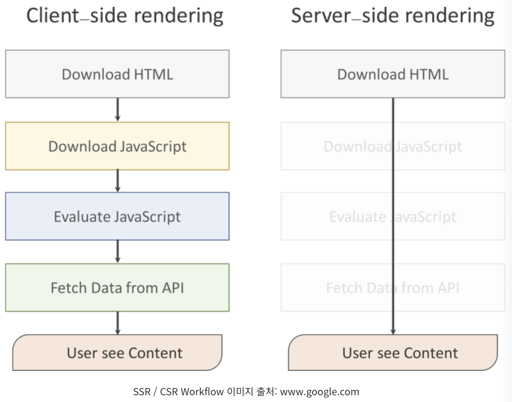
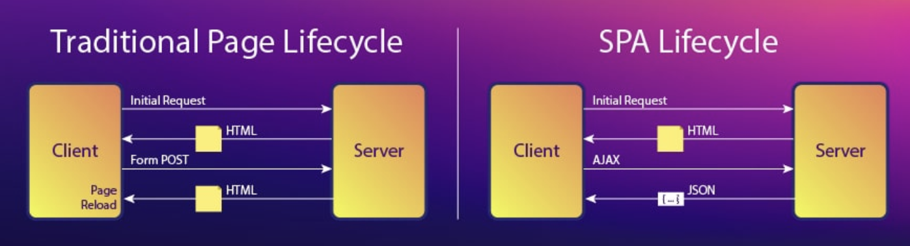
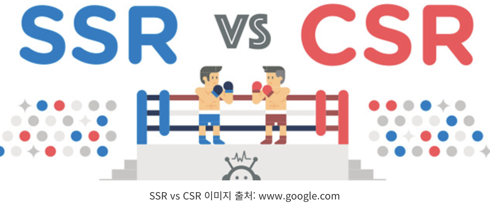

# [Rendering](https://ivorycode.tistory.com/entry/SSRSever-Side-Rendering%EA%B3%BC-CSRClient-Side-Rendering)
서버로부터 HTML 파일을 받아 브라우저 화면에 표시하고 그리는 작업을 렌더링이라고 한다.

### 렌더링 과정 
- 서버로부터 데이터를 응답받아 HTML을 Parsing 하여 DOM트리를 생성한다.
- DOM트리가 구축되는 동안 브라우저는 Render트리를 구축한다.
- CSS설정 및 위치를 설정한다.
- Render트리가 그려지고 브라우저 화면에 표시된다.
---

---
# SSR(Server Side Rendering)
- SSR은 전통적인 웹 어플리케이션 렌더링 방식으로 사용자가 웹 페이지에 접근할 때, 서버에 페이지에 대한 요청을 한다. 
- 이때 서버에서는 HTML, View와 같은 자원(Resource) 들을 어떻게 보여줄지 해석하고 렌더링 하여 사용자에게 반환한다. 
- 참고로 웹 서버에 요청할 때마다 브라우저에서 새로고침이 일어나고 서버에 새로운 페이지에 대한 요청을 하는 방식이다.

---
### SSR 장점 
- 검색엔진최적화(SEO) 가능
SSR의 가장 큰 장점중 하나다. SEO에 대해선 아래에 따로 언급한 부분을 참고하도록 하자.
- 초기로딩속도가 빠름
처음 렌더링된 HTML을 클라이언트에게 전달해주기 때문에 초기 로딩 속도를 줄일 수 있다. 또한 JavaScript파일을 불러오고 렌더링 작업이 완료되지 않아도 사용자가 콘텐츠를 이용할 수 있다.

---
### SSR의 단점
- 프로젝트 구조가 복잡해진다.
단순 렌더링만 한다면 문제가 발생되진 않는다. 하지만, Redux, React Router 등 여러 라이브러리와 함께 연동하여 서버에서 데이터를 가져와 렌더링 하는 상황이 발생한다면, 프로젝트가 많이 복잡해질 수 있다.
- 매번 새로고침이 발생한다.
위에서 잠시 언급했지만, SSR은 서버에 요청할 때마다 새로고침이 발생한다. 매번 새로고침이 발생한다는 것은 서버와 잦은 응답을 한다는 의미이며 자연스럽게 서버에 부담을 주게 된다. 서버에 부담이 간다면 당연히 성능이 악화되기 마련!

---
# [SPA(Single Page Application)](https://m.blog.naver.com/seek316/222085340333)
### SPA 등장배경
- 앞의 SSR은 기존에 존재하는 방식이라고 언급하였다. 그러다 기술이 발전으로 모바일 시대가 도래하면서 모바일 환경에 최적화된 서비스가 필요해졌다. 
- 하지만 일반적인 컴퓨터에 비해 성능이 낮은 모바일에 최적화시키는 일이란 매우 어려운 일이었고, 기존과 다른 방식이 필요했다. 그래서 등장한 개념이 바로 SPA다.

---
### SPA 특징 
- SPA는 최초 한 번 페이지 전체를 로딩한 이후부터는 데이터만 변경하여 사용하는 단일 페이지로 구성된 웹 애플리케이션이다. 
- SPA에서는 화면 구성에 필요한 모든 HTML을 클라이언트가 갖고 있고 서버 측에는 필요한 데이터를 요청하고 JSON으로 받기 때문에 기존의 어플리케이션에 비해 화면을 구성하는 속도가 빠르다.

---
## SPA frameworks
- [React](https://react.dev/)
- [Vue.js](https://vuejs.org/)
- [Angular](https://angular.io/)

---
# CSR(Client Side Rendering)
- 클라이언트에서 렌더링 하는 방식(SPA)
- 처음 웹 서버에 요청할 때, 데이터가 없는 문서를 반환한다.
- HTML 및 static 파일들이 로드된다. 이때, 데이터가 있다면 데이터 또한 서버에 요청하여 화면에 나타낸다.
- 브라우저가 서버에 HTML과 static 파일을 요청한 후 로드되면, 사용자의 상호작용에 따라 JavaScript를 통해 동적으로 렌더링을 한다.
- 필요에 따라 데이터를 서버에 요청해서 받아와 렌더링 한다.

---
### CSR 장점 
- 트래픽 감소와 빠른 인터랙션
  - 아까 SSR은 서버와 잦은 응답 때문에 자연스럽게 서버에 부담은 준다고 했다. 
  - 반면, CSR은 사용자의 행동에 따라 필요한 부분만 다시 읽어 들이기 때문에 서버 측에서 전체 페이지를 다시 읽어 들이는 것보다 빠른 인터랙션이 가능하다. 
  - 즉, 필요하고 변경된 데이터만 받아올 수 있다는 의미다. 물론 서버의 부담도 줄일 수 있다.

---
### CSR의 단점
- 초기 구동 속도가 느리다.
  - SSR은 View를 서버에서 렌더링 하여 가져오기 때문에 초기 구동 속도가 빠르다고 했다. 하지만 CSR은 서버에서 View를 렌더링 하지 않는다. 
  - 위에서도 언급해 지겹겠지만 CSR은 HTML 다운, JavaScript 파일, 각 종 자원(Resource)을 다운로드한 후에 브라우저에서 렌더링을 하기 때문에 초기 구동 속도가 느리다.
- 검색엔진 최적화(SEO)가 어렵다.
  - CSR방식으로 이루어진 웹 페이지에서는 View를 생성하기 위해선 반드시 JavaScript를 실행시켜야 한다. 
  - 하지만, 대부분 웹 크롤러 봇들은 JavaScript파일을 실행시키지 못하기 때문에 HTML에서만 콘텐츠들을 수집하게 되고 CSR페이지를 빈 페이지로 인식하게 된다.
- 보안 문제가 있다.
  - SSR은 사용자 정보를 서버 측에서 세션으로 관리를 하지만, CSR은 쿠키 말고는 사용자 정보를 저장할 공간이 마땅치 않다.

---
# SSR vs CSR(or SPA)

---
### SSR
- SSR은 초기 로딩 속도가 빠르고 SEO에 유리하다.
- 하지만, View를 변경할 때, 서버에 계속 요청해야 하므로 서버에 부담을 준다.

### CSR
- 초기 로딩 후, 서버에 재요청을 할 필요 없이 클라이언트 내에서 작업이 이뤄지므로 빠르다.
- 하지만, 서버에서 View를 렌더링 하지 않고, 여러 자원(Resource)들을 다운을 받고 난 후 렌더링 하는 방식이기에 초기 로딩 속도가 느리고, SEO에 대한 문제가 있다.

즉, SSR과 CSR을 적절히 활용해야 한다.
다양한 라이브러리를 통해 SSR과 CSR의 방식 모두 구성하는 방법이 존재한다.

