# [Web Browser](https://ko.wikipedia.org/wiki/%EC%9B%B9_%EB%B8%8C%EB%9D%BC%EC%9A%B0%EC%A0%80)
웹 브라우저는 웹 서버에서 이동하며 쌍방향으로 통신하고 HTML 문서나 파일을 출력하는 응용 소프트웨어이다.
- 렌더링(Rendering):    
서버로부터 넘겨받은 HTML 코드는 웹 브라우저에서 읽어온 후 화면에 시각적으로 표시하게 되는데, 이 과정을 렌더링이라고 합니다.

---
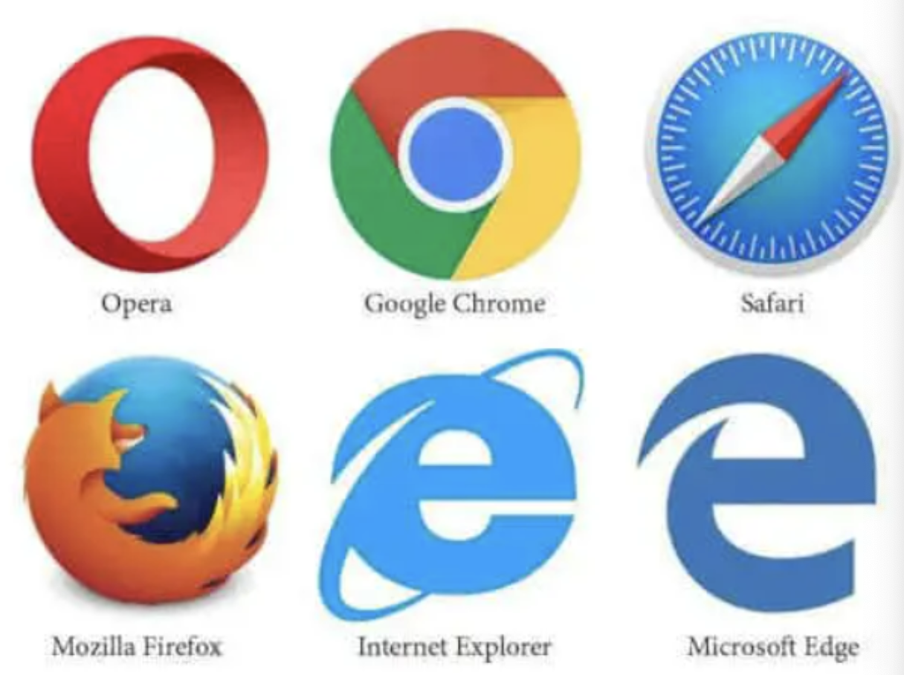

---
# [웹표준(Web Standards)](https://seulbinim.github.io/WSA/standards.html#%EC%9B%B9%ED%91%9C%EC%A4%80-%EC%9D%B4%EB%9E%80)
각 웹 브라우저별로 같은 문서(HTML)을 다르게 표현을 할 수 있습니다. 그래서 그런 문제점들을 제거하기 위하여 웹표준을 정의하고 각 웹 브라우저를 만드는 회사들에 해당 표준을 준수하도록 권하고하고 있습니다.

---
## 웹표준의 장점
### 1. 웹 접근성 수준의 향상   
웹표준을 준수하면, 웹 브라우저, 모바일 등 다양한 기기에서 올바르게 표시되기 때문입니다.
### 2. 검색 친화적인 웹 사이트 구현   
meta 요소를 이용한 정확한 문서 정보의 제공과 적절한 제목(heading)의 사용, 의미에 맞는 마크업은 검색 시 결과에 영향을 미칠 수 있는 중요한 정보입니다.

---
### 3. 구조와 표현의 분리:    
구조는 HTML 등의 마크업 언어로 구축하고, 디자인과 같은 표현 정보는 CSS를 이용함으로써 구조와 표현을 분리된 독립적인 구현이 가능하도록 도와줍니다.
### 4. 손쉬운 유지 보수 및 비용 절감 효과:   
구조와 표현을 분리하여 제작함으로써 웹 페이지의 리뉴얼을 하는 경우 기존 소스를 재사용할 수 있게 되었습니다.
### 5. 호환성 확보:    
웹 브라우저의 버전에 따라 같은 문서(HTML)이 다르게 표현되는 경우가 발생할 수 있다. 이런 경우를 방지하기 위해서 웹표준을 준수할 필요가 있습니다.

---
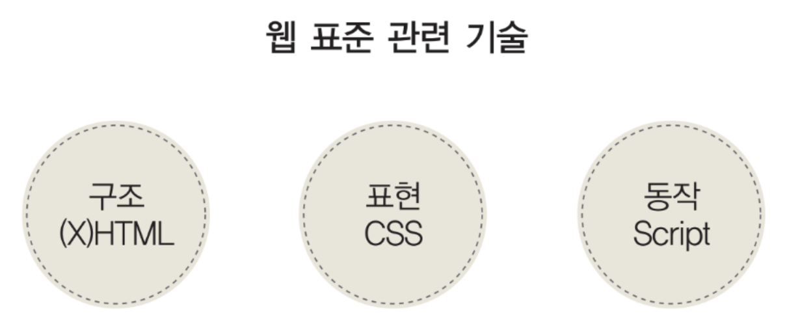

---
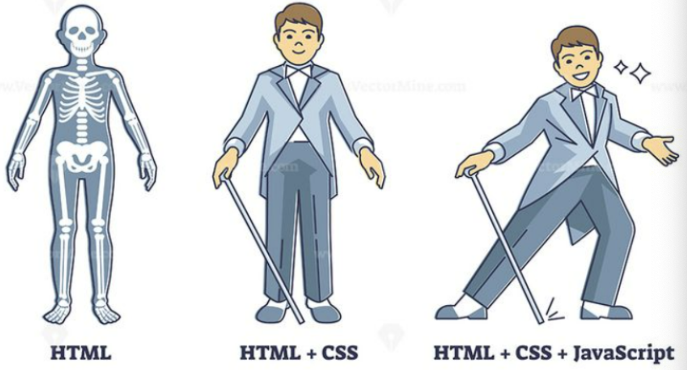

---
# 크로스 브라우징(Cross-Browsing)
- 웹 페이지 제작 시에 모든 브라우저에서 깨지지 않고 의도한 대로 올바르게(호환성) 나오게 하는 작업을 말합니다.
- 이 작업이 필요한 이유는 각 브라우저마다 랜더링 엔진이 다르기 때문입니다.
- HTML, CSS, JavaScript 작성 시 W3C의 웹 규격에 맞는 코딩을 함으로써 어느 브라우저, 기기에서 사이트가 의도된 대로 보이고 작동하는 기법입니다.

아래는 동일한 코드이더라도 브라우저마다 화면이 다르게 보이는 예시입니다.

---
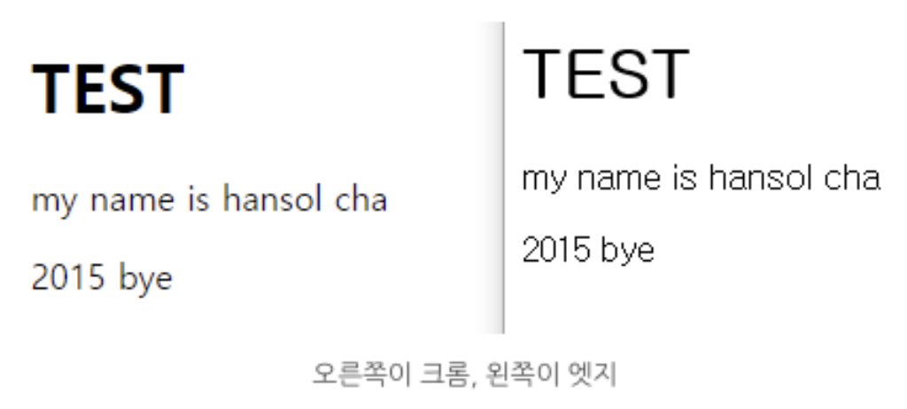

---
# [브라우저별 점유율](https://gs.statcounter.com/browser-market-share#monthly-202203-202303-bar)
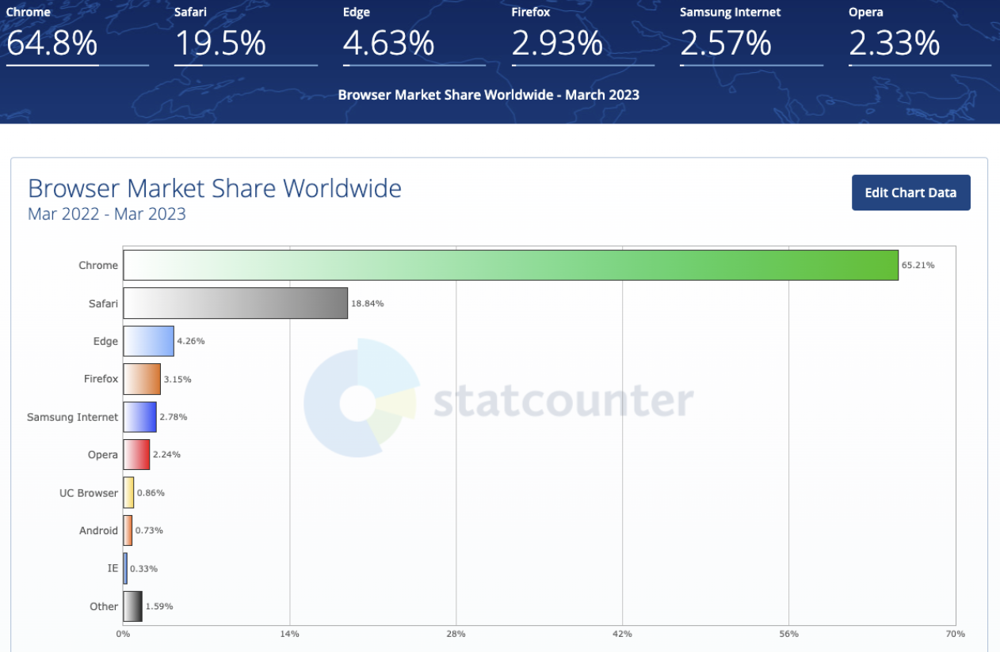

---
# [웹접근성(Web Accessibility)](https://seulbinim.github.io/WSA/accessibility.html#%EC%9B%B9%EC%A0%91%EA%B7%BC%EC%84%B1%EC%9D%98-%EA%B0%9C%EC%9A%94)
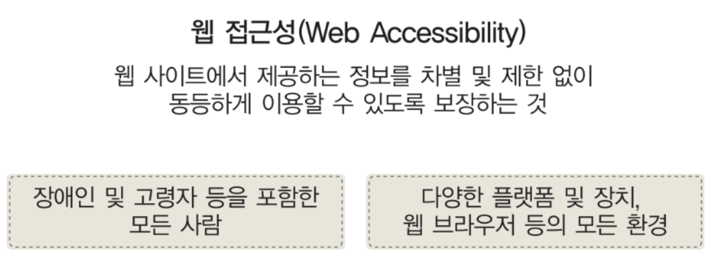

---
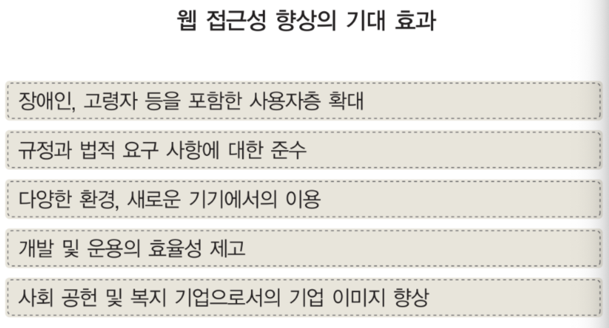

---
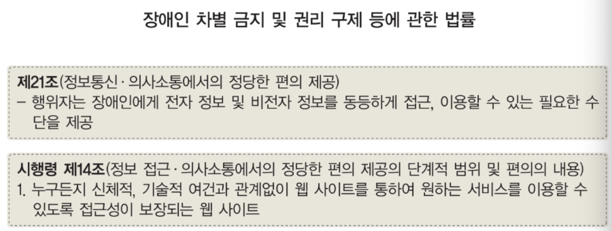

---
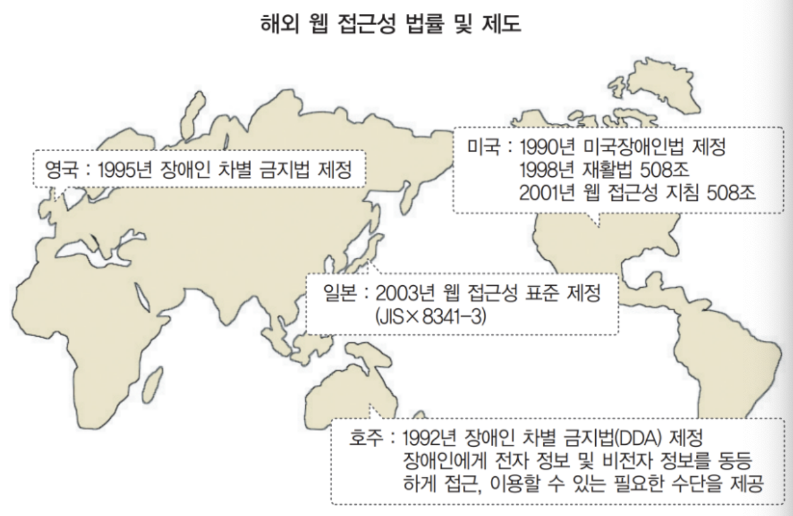

---
# [검색 엔진 최적화(Search Engine Optimize)](https://www.ascentkorea.com/seo-complete-guide-2022/)
## [검색엔진 효과](https://www.insilicogen.com/blog/300)
- SEO (Search Engine Optimization 검색엔진 최적화)는 웹 페이지 검색엔진이 자료를 수집하고 순위를 매기는 방식에 맞게 웹 페이지를 구성하여 잠재 고객(사용자)을 더 많이 사이트로 유입하기 위한 작업입니다.
- 또한 특정 키워드로 검색엔진에 상위 노출을 진행하는 관점에서, 웹사이트를 검색엔진 알고리즘에 최적화하여 검색결과 상위에 표시하기 위한 일종의 사이트를 최적화하는 마케팅 방법입니다.

---
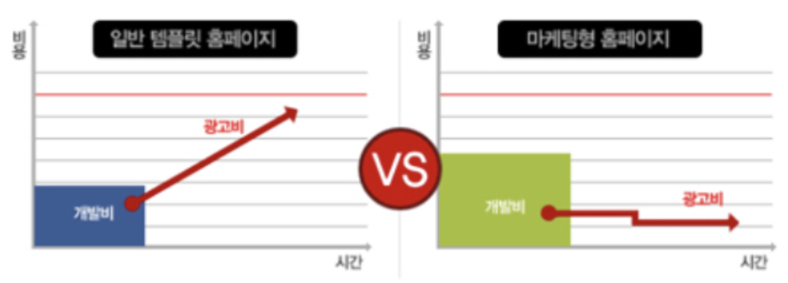

---
## 검색엔진 3단계 프로세스
- 크롤링(Crawling):    
웹 크롤러가 웹페이지의 콘텐츠를 복사하여 검색엔진으로 가져옵니다.
- 인덱싱(Indexing):     
가져온 콘텐츠를 주제별로 색인하여 보관합니다.
- 랭킹(Ranking):      
검색 의도에 맞춰 색인된 콘텐츠에 순위를 부여한 후 결과로 제공합니다.

---
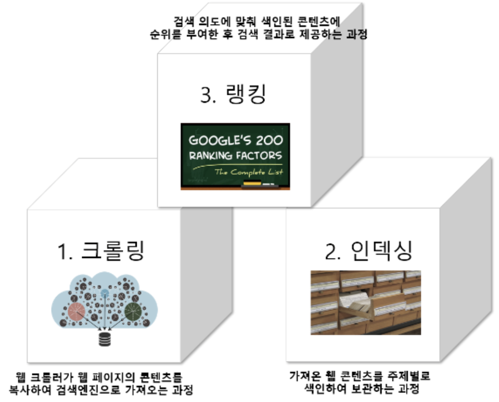

---
# [통신 프로토콜](https://ko.wikipedia.org/wiki/%ED%86%B5%EC%8B%A0_%ED%94%84%EB%A1%9C%ED%86%A0%EC%BD%9C)
통신 프로토콜 또는 통신 규약은 컴퓨터나 원거리 통신 장비 사이에서 메시지를 주고 받는 양식과 규칙의 체계이다.

- 프로토콜의 예시들
  - HTTP : Hyper Text Transfer Protocol
  - HTTPS : Hyper Text Transfer Protocol Secure
  - FTP : File Transfer Protocol
  - SMTP : Simple Mail Transfer Protocol
  - SSH : Secure Shell

---
# [HTTP 프로토콜](https://shlee0882.tistory.com/107)
## 작동 방식
- HTTP는 서버/클라이언트 모델을 따른다.
- 클라이언트(브라우저)에서 요청(request)를 보내면 서버는 요청을 처리해서 응답(response)한다.

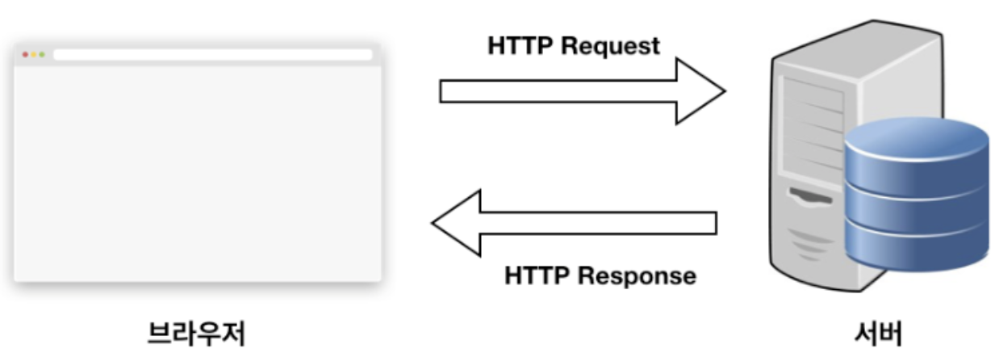

---
클라이언트:   
- 서버에 요청하는 클라이언트 소프트웨어(IE, Chrome, Firefox, Safari ...)가 설치된 컴퓨터를 이용한다.
- 클라이언트는 URI를 이용해서 서버에 접속하고, 데이터를 요청할 수 있다.

서버:    
- 클라이언트의 요청을 받아서, 요청을 해석하고 응답을 하는 소프트웨어가 설치된 컴퓨터(Apache, nginx, IIS, lighttpd) 등이 서버 소프트웨어다.
- 웹서버는 보통 표준포트인 80번 포트로 서비스한다.

---
## HTTP 프로토콜 특징 

---
### 1. Connectionless 프로토콜 (비연결 지향)
클라이언트가 서버에 요청(Request)을 했을 때, 그 요청에 맞는 응답(Response)을 보낸 후 연결을 끊는 처리방식이다.

- HTTP 1.1 버전에서 커넥션을 계속 유지하고, 요청(Request)에 재활용하는 기능이 추가되었다. (HTTP Header)에 keep-alive 옵션을 주어 커넥션을 재활용하게 한다. HTTP 1.1 버전에선 디폴트(default) 옵션이다.
- HTTP가 TCP위에서 구현되었기 때문에(TCP : 연결 지향, UDP : 비연결 지향) 연결 지향적이라고 할 수 있다는 얘기가 있어 논란이 있지만, 아직까진 네트워크 관점에서 keep-alive는 옵션으로 두고, 서버 측에서 비연결 지향적인 특성으로 커넥션 관리에 대한 비용을 줄이는 것이 명확한 장점으로 보기 때문에 비연결 지향으로 알아두었다.

---
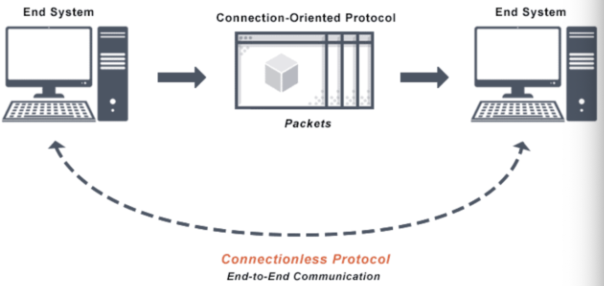

---
### 2. Stateless 프로토콜
커넥션을 끊는 순간 클라이언트와 서버의 통신이 끝나며 상태 정보는 유지하지 않는 특성이 있다.

- 클라이언트와 첫 번째 통신에서 데이터를 주고받았다 해도, 두 번째 통신에서 이전 데이터를 유지하지 않는다.
- 하지만, 실제로는 데이터 유지가 필요한 경우가 많다.

---
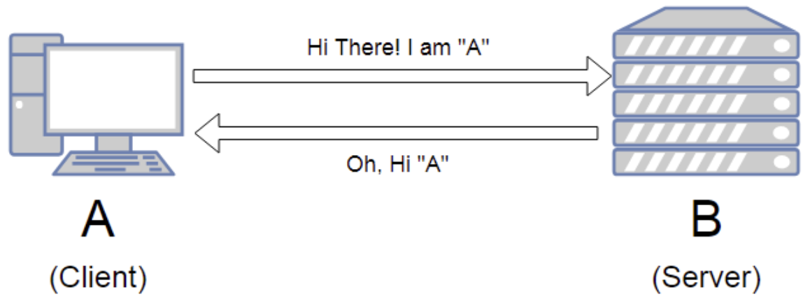

---
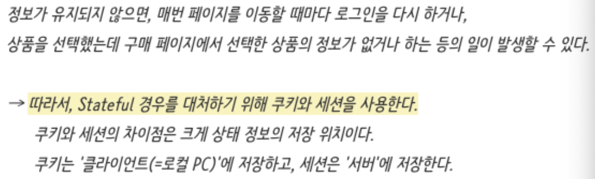

---
## URL(Uniform Resource Locators)
URL(Uniform Resource Locators)은 개발자가 아니더라도 이미 우리에게 익숙한 용어입니다. 서버에 자원을 요청하기 위해 입력하는 영문 주소입니다. 아무래도 숫자로 되어 있는 IP 주소보다는 훨씬 기억하기 쉽기 때문에 사용하는 것 같습니다.

URL 구조는 아래와 같습니다.
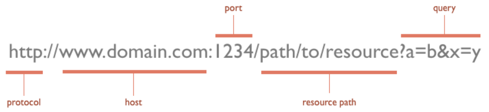

---
## Method
- 메서드는 요청의 종류를 서버에게 알려주기 위해서 사용한다.
- 다음은 요청에 사용할 수 있는 메서드들이다.
  - GET : 정보를 요청하기 위해서 사용한다. (SELECT)
  - POST : 정보를 밀어넣기 위해서 사용한다. (INSERT)
  - PUT : 정보를 업데이트하기 위해서 사용한다. (UPDATE)
  - DELETE : 정보를 삭제하기 위해서 사용한다. (DELETE)

---
## 응답코드/상태코드
- 상태 코드는 3자리 숫자로 만들어져 있으며, 첫번째 자리는 1에서 5까지 제공됩니다.
- 첫번째 자리가 4와 5인 경우는 정상적인 상황이 아니기 때문에 사이트 관리자가 즉시 알아야 하는 정보입니다.

간략하게 상태코드에 대해 설명하자면 다음과 같습니다
- 1xx(정보) : 요청을 받았으며 프로세스를 계속 진행합니다.
- 2xx(성공) : 요청을 성공적으로 받았으며 인식했고 수용하였습니다.
- 3xx(리다이렉션) : 요청 완료를 위해 추가 작업 조치가 필요합니다.
- 4xx(클라이언트 오류) : 요청의 문법이 잘못되었거나 요청을 처리할 수 없습니다.
- 5xx(서버 오류) : 서버가 명백히 유효한 요청에 대한 충족을 실패했습니다.

---
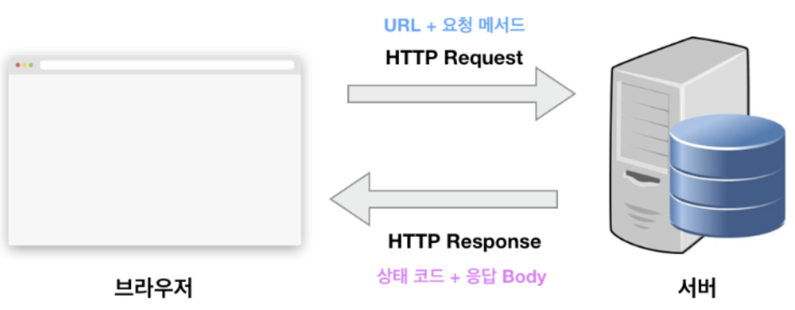

---
# [HTTPS 프로토콜](https://velog.io/@usreon/%EC%9D%B8%EC%A6%9D%EB%B3%B4%EC%95%88-HTTPS-%ED%94%84%EB%A1%9C%ED%86%A0%EC%BD%9C)
### HTTP
- 인터넷 상에서 정보를 주고 받기 위한 프로토콜
- 암호화되지 않은 방법으로 데이터를 전송(악의적 감청, 데이터 변조 가능)

### HTTPS(Hyper Text Transfer Protocol Secure)
- 보안이 강화된 HTTP
- 모든 HTTP 요청과 응답 데이터는 네트워크로 보내지기 전에 암호화된다.
- HTTPS는 HTTP의 하부에 SSL과 같은 보안 계층을 제공함으로써 동작한다
  > HTTP 요청을 SSL 혹은 TLS라는 알고리즘을 이용해, HTTP 통신을 하는 과정에서 내용을 암호화하여 데이터를 전송하는 방법이다.

---
SSL, TLS : 네트워크를 통해 작동하는 서버, 시스템 및 응용 프로그램간 인증 및 데이터 암호화를 제공하는 암호화 프로토콜

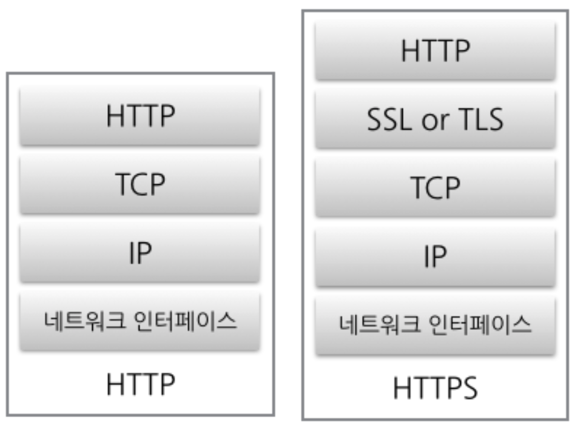

