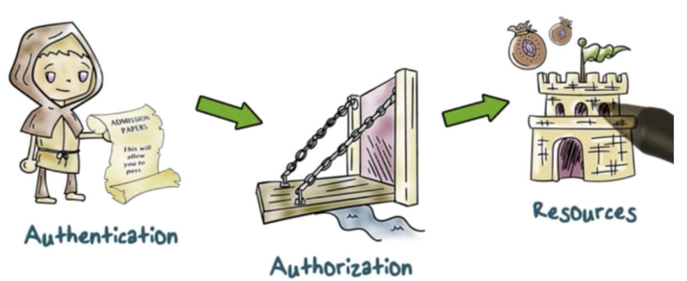
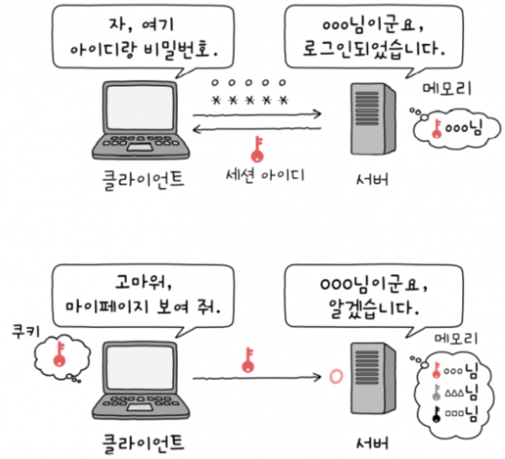
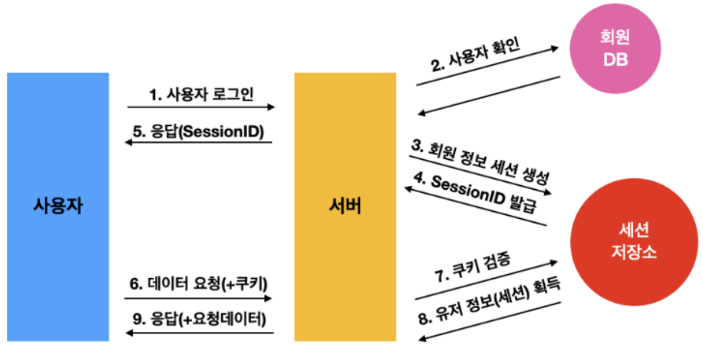
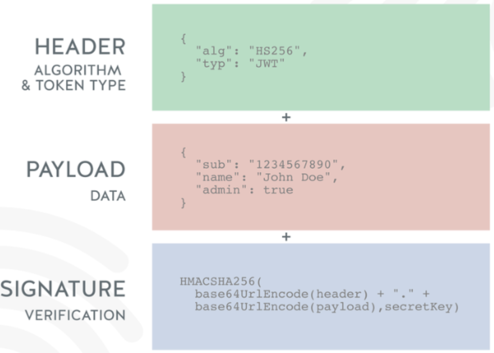
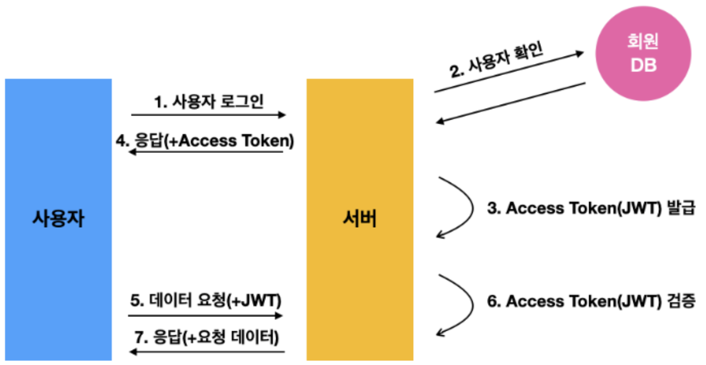
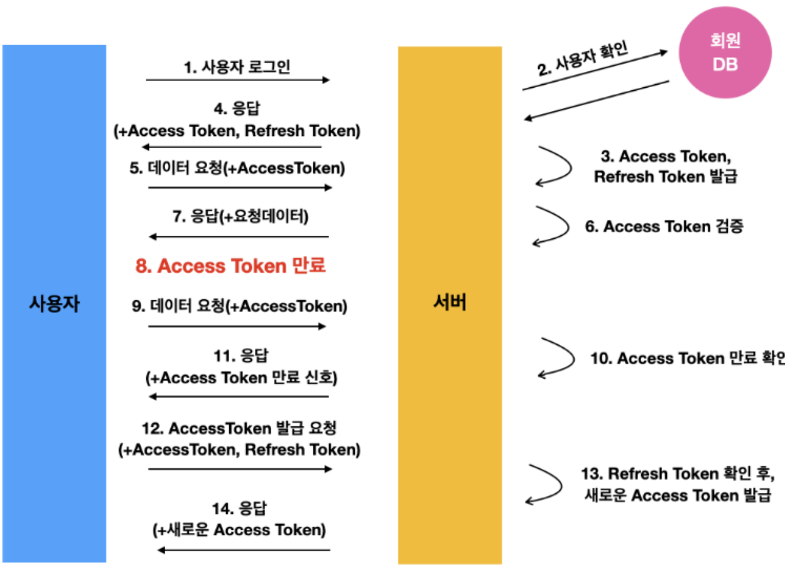

# [Authentication(인증)/Authorization(인가)](https://velog.io/@kingth/%EC%84%9C%EB%B2%84-%EC%9D%B8%EC%A6%9D-%EB%B0%A9%EC%8B%9D%EC%84%B8%EC%85%98%EC%BF%A0%ED%82%A4-%ED%86%A0%ED%81%B0)

---
## Authentication(인증): 로그인
- 클라이언트가 자신이 주장하는 사용자와 같은 사용자인지를 확인하는 과정
- 유저가 누구인지 확인하는 절차
  > 예) 회원가입하고 로그인 하는 것.
- 필요한 이유 : 서비스를 누가 사용하며, 추적이 가능하도록 하기 위함, 타인에게 사용자의 정보를 보호하기 위함

## Authorization(인가): 권한
- 권한부여, 클라이언트가 하고자 하는 작업이 해당 클라이언트에게 허가된 작업인지를 확인
- 특정 자원에 대한 접근 권한이 있는지 확인하는 절차
- 유저에 대한 권한을 허락하는 것.

---
# 인증방식
1. Session/Cookie 방식
2. 토큰 기반 인증 방식(JWT; Json Web Token)

---
## 1. Session/Cookie 방식
### Cookie    
> 쿠키는 일종의 서버와 클라이언트가 대화하기 위한 수단     
- 브라우저가 서버와 연결이 되었을 때 브라우저에서 자동적으로 쿠키를 생성하고, response 할 때 쿠키를 담아서 보낸다.
- 특정 호스트에서 생성된 쿠키는 이후 모든 요청마다 서버로 전송됨
- 요청 해더의 set-cookie 속성에 정보를 담을 수 있음.
- 쿠키에 담긴 데이터는 브라우저에서 관리됨.
- 이름, 값, 만료 날짜, 경로 정보로 구성.

---

---
### Session    
> 서버와 클라이언트의 연결이 활성화된 상태
- 클라이언트가 서버와 통신을 시작하면 서버는 해당 클라이언트에 대해 유일한 값인 세션 id를 부여, 세션 스토리지에 세션 정보를 저장함.
- 클라이언트는 이 세션id를 쿠키를 통해 기억함.
- 이후 클라이언트가 어떤 요청을 보낼 때마다 헤더의 cookie에 세션 id를 담아서 전송함.
- 서버는 클라이언트가 보낸 요청의 쿠키에 담긴 세션 id와 세션 스토리지에 담긴 세션 id를 대조해 인증 상태를 판단함.
(즉, 세션과 쿠키는 완전히 분리된 개념이 아니며 세션은 쿠키를 기반으로 함)
- 각 클라이언트마다 유니크한 세션 객체가 주어지고, 이 세션 객체에 데이터를 담아 관리할 수 도 있음.
(세션 객체가 자물쇠로 잠긴 상자라면 세션 id 가 열쇠인 셈)
- 세션을 사용하지 않고 쿠키만으로 어떤 데이터를 주고받는다면, 클라이언트는 이미 모든 데이터를 알고 있다는 것.

---

---
### 인증순서
1. 사용자 로그인 요청
2. 서버에서 계정 정보를 읽어 사용자를 확인 하고, 사용자의 고유한 ID를 부여하여 세션 저장소에 저장한 후, 이와 연결된 세션ID를 발급한다.
3. 사용자는 서버에서 해당 세션ID를 받아 쿠키에 저장 한 후, 인증이 필요한 요청마다 쿠키를 헤더에 실어 보낸다.
4. 서버는 쿠키를 받아 세션 저장소에서 대조 후 대응되는 정보를 가져온다.
5. 인증이 완료 되고 서버는 사용자에 맞는 데이터를 보내준다.

---

---
## 2. 토큰 기반 인증 방식(JWT; Json Web Token)
Session/Cookie 방식은 해커가 인증된 사용자의 Cookie를 실어 서버에 요청을 보내면 서버는 인증된 사용자인지, 해커인지 구별할 방법이 없습니다.   
그래서 인증에 필요한 정보를 암호화하는 방식인 JWT이 만들어졌습니다.

### Token
> 인증을 위해 사용되는 암호화된 문자열
- 사용자가 인증에 성공하면 서버는 토큰을 생성해서 클라이언트로 보낸다.
- 토큰도 세션과 마찬가지로 사용자가 보내는 요청에 포함된다.
- 세션 인증에서는 서버가 세션ID를 저장하고 클라이언트가 쿠키에 실어보낸 세션ID와 대조해서 확인하는 반면, 토큰을 사용하면 요청을 받은 서버는 토큰이 유효한지를 확인만 함.
- 세션 인증에 비해 서버 운영의 효율이 더 좋다.

---
- JWT(Json Web Token) 구조
  - `Header` : 위 3가지 정보를 암호화할 방식(alg), 타입(type) 등
  - `Payload` : 서버에서 보낼 데이터. 일반적으로 유저의 고유 ID값, 유효기간
  - `Verify Signature` : Base64 방식으로 인코딩한 Header,payload 그리고 SECRET KEY를 더한 후 서명

---
### 인증순서 
1. 사용자가 로그인을 한다.
2. 서버에서는 계정 정보를 읽어 사용자를 확인 후, 사용자 고유ID값을 부여한 후, 기타 정보와 함께 Payload에 넣는다.
3. JWT의 유효기간 설정
4. 암호화할 Secret Key를 이용해 Access Token을 발급한다.
5. 사용자는 Access Token을 받아 저장한 후, 인증이 필요한 요청마다 토큰을 헤더에 실어 보낸다.
6. 서버에서는 해당 토큰의 Verify Signature를 Secret Key로 복호화한 후, 조작여부, 유효기간을 확인한다.
7. 검증이 완료되면, Payload를 디코딩하여 사용자의 ID에 맞는 데이터를 가져온다.

---

---
### Refresh Token
- Access Token(JWT)를 통한 인증 방식의 문제는 제 3자에게 탈최당할 경우 보안에 취약하다는 점입니다.
- Refresh Token은 Access Token과 똑같은 형태의 JWT입니다. 처음에 로그인을 완료 했을 때 Access Token(짧은 유효기간)과 동시에 발급되는 Refresh Token은 긴 유효기간을 가지면서, Access Token은 만료됐을 때 새로 발급해주는 열쇠가 된다.
- Access Token은 탈취 당하면 정보가 유촐되는 건 동일하지만, 유효기간이 짧기 때문에 좀더 안전합니다.

---
#### Refresh Token 인증 방식
1. 사용자가 ID, PW를 통해 로그인
2. 서버에서는 회원 DB에서 값을 비교한다.(보통 PW는 일반적으로 암호화해서 들어간다.)
3. 사용자 인증이 되면 서버에서 Access Token, Refresh Token을 발급, 보통 회원 DB에 Refresh Token을 저장해준다.
4. 서버는 사용자에게 Access Token, Refresh Token 을 보낸다.
5. 사용자는 Refresh Tokendms 은 안전한 저장소에 저장 후, Access Token을 헤더에 실어 요청을 보낸다.
6. 서버는 Access Token을 검증 후
7. 이에 맞는 데이터를 사용자에게 보내준다.

---
8. 시간이 흘러 Access Tokendl 만료
9. 사용자는 만료된 Access Token을 헤더에 실어 요청을 보낸다.
10. 서버는 Access Token이 만료된을 확인
11. 만료된 토큰임을 알리고 권한없음을 신호로 보낸다.
Access Token이 만료될때 마다 9~11 과정을 거칠 필요는 없다. Access Token의 Payload를 통해 유효기간을 알수 있다.
따라서 프론트엔드 단에서 API 요청 전에 토큰이 만료 됐다면 바로 재발급 요청 가능.
12. 사용자는 Refresh Token과 Access Token을 함께 서버로 보낸다.
13. 서버는 받은 Access Token이 조작되지 않았는지 확인한후, Refresh Token과 사용자의 DB에 저장되어 있던 Refresh Token을 비교한다.
14. 서버는 Token이 동일하고 유효기간도 지나지 않았다면 새로운 Access Token을 사용자에게 보내준다.
15. 새로운 Access Token을 헤더에 실어 API 요청을 한다.

---

